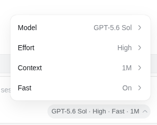
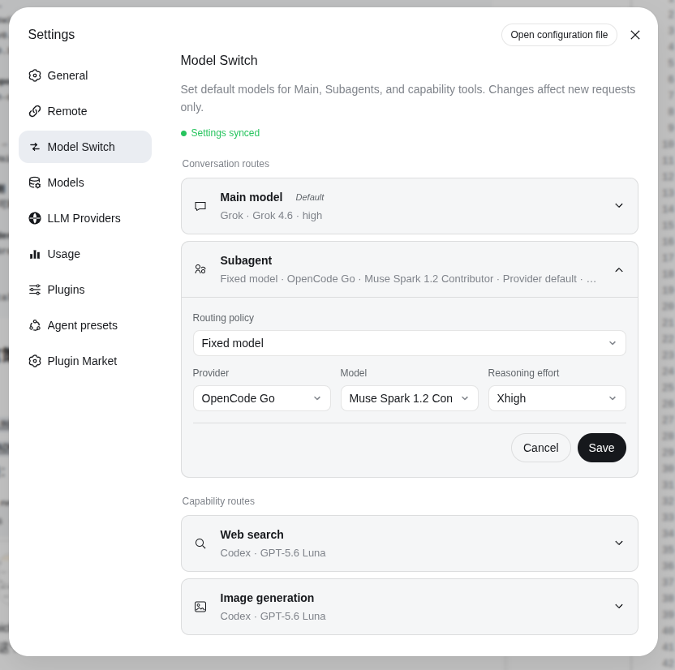
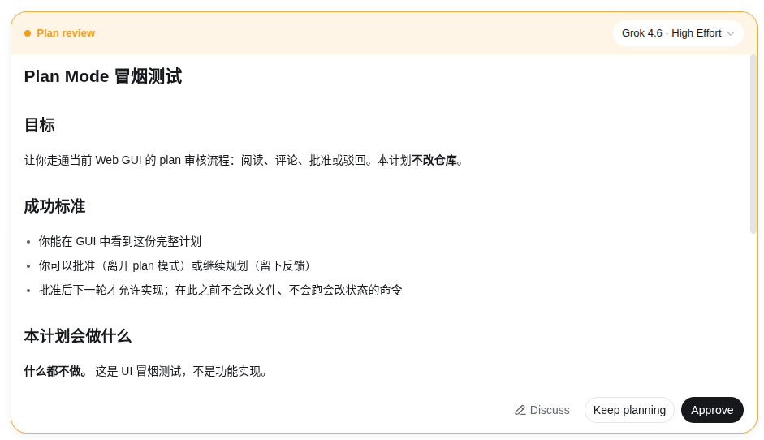

# Model Switch

[English](README.md) | 中文

在 DeepSeek Harness 中为 Main、Subagent、Web Search、图像生成、当前会话和 Plan 执行模型配置明确路由。Model Switch 只使用 DSH 公开服务和 Provider 自有 Adapter；不修改 DSH Core，也不管理 Provider 登录凭证。

<p align="center"></p>

## 路由

| 路由 | 行为 |
| --- | --- |
| Main 模型 | 新建会话的默认 provider、model 和可选 effort；不迁移已有会话。 |
| Subagent | 跟随当前父请求，或使用固定 provider/model/effort；Workflow 显式覆盖始终优先。 |
| Composer Picker | 只修改当前会话，并提交 catalog 中的原始 model id；Main 默认值保持不变。 |
| Plan Review | 在发送 Plan 审核确认前，先提交执行模型。 |
| Web Search | 保留官方 `web_search`；部署显式启用后，通过 Provider 动态声明的独立搜索适配器路由。 |
| 图像生成 | 提供一个稳定的 `generate_image` 工具，通过选定的 Codex 或 Grok Adapter 路由。 |

无效、不可用或不受支持的路由会明确失败。Model Switch 不会静默换到另一个 provider 或模型。

当前会话成功打开 Antigravity 原生会话后，Composer 和 Plan Review Picker 会在该会话内禁用其他 provider，同时保留 Antigravity 模型与 effort 控件。DSH 全局 Picker 锁仍拥有最高优先级。

## 配置 Main 和 Subagent

打开 **设置 → Model Switch**。Main 修改只影响新建会话。Subagent 可以跟随 Main，也可以使用固定 provider、model 和 effort。

切换 Main 或固定 Subagent 的 provider/model 时，会用目标模型的默认 effort 替换旧模型的 effort；目标模型不支持推理时不传 effort。



Follow Main 先读取当前父请求，再读取配置的 Main 默认值。固定路由会在官方 Subagent descriptor 创建前注入。DSH 0.1.2-alpha.4 会在该 descriptor 中携带 provider、model 和固定 reasoning effort。

## 自定义模型如何出现在 Picker

Model Switch 不会把自身设置中任意填写的字符串变成模型。Provider 插件必须先把模型发布到 DSH 官方 Model Catalog：

```text
Provider 配置
→ Provider 将模型行发布到 DSH Catalog
→ 当前会话 Model Directory 提供 provider/model 元数据
→ Model Switch 对 Catalog 行分组
→ Picker 提交原始 provider id 和 model id
```

Catalog 提供 provider 名称、model id/name、reasoning efforts 和 default effort。已经保存但不再出现在 Catalog 中的路由，会在 Settings 中显示为 unavailable；Picker 不会假装它仍可路由。

### 变体 id 规则

Model Switch 按 provider，以及剥离以下后缀后的 model id 对 Catalog 行分组：

| Catalog model id | Picker 变体 |
| --- | --- |
| `acme-v1` | 标准模型 |
| `acme-v1-fast` | Fast |
| `acme-v1-128k` | Context 128K |
| `acme-v1-1m` | Context 1M |
| `acme-v1-1m-fast` | Context 1M + Fast |

规则：

- `-fast` 生成 Fast 轴。
- `-<n>k` 和 `-<n>m` 生成 Context 档位；可以与 `-fast` 按任意顺序组合。
- `reasoning.efforts` 生成 Effort 选项；`reasoning.defaultEffort` 是初始值。
- 切换 Fast、Context 或 Thinking 变体时，只有目标 Catalog 行支持当前 effort 才会保留；否则改用目标行的默认 effort，目标没有默认值时不传 effort。
- Catalog 中存在 reasoning 元数据时，该模型行具备 Thinking 能力。
- 无法识别的 id 不会被丢弃，而是作为独立 model family 显示。

组合选择必须由 Provider 发布组合行。只有 `acme-v1-fast` 和 `acme-v1-1m` 不能表示 Fast + 1M；还必须发布 `acme-v1-1m-fast`。Picker 永远不会合成 Provider 没有发布的 model id。

## Plan Review

Plan Review 拥有独立于 Main 的执行模型草稿。**确认执行**会先把该模型提交到当前会话，再回答待处理的 Plan 审核。模型提交失败时，审核保持待处理并允许重试。**拒绝**和**去聊天里说**不会执行 Plan。



## Model Switch 不会改变什么

- `web_fetch` 及其配置的 provider
- Vision 路由、`read_image` 和普通聊天附件
- Provider 登录、凭证或 Provider 设置卡
- 官方 Agent Presets
- 已有的 Provider 专属图像工具
- Main 默认值修改前已经存在的会话

## 安装

安装 Model Switch，以及实际使用的 Provider Adapter。以下版本已在 DSH 0.1.2-alpha.4 验证：

```sh
DSH_HOME=~/.dsh dsh plugin --profile web add github:NOirBRight/dsh-llm-codex#v0.3.9
DSH_HOME=~/.dsh dsh plugin --profile web add github:NOirBRight/dsh-llm-grok#v0.3.9
DSH_HOME=~/.dsh dsh plugin --profile web add github:NOirBRight/dsh-model-switch#v0.4.6
```

### 搜索供应商统一接入（开发分支，尚未发布）

搜索列表来自 Host 上已有的 `ModelSwitchAdapterRegistry`，Provider 自声明名称和独立搜索模型；浏览器只收到普通元数据，不收到凭据或可执行函数。注册、卸载会通知订阅者；原地修改模型声明最迟由 20 秒心跳更新。`ProviderDirectory` 继续负责客户端 role/usage，不另造注册表。模型原生联网不等于独立 `web_search` 适配器。

DeepSeek 薄适配器调用官方公开 `DeepSeekSearchProvider`，复用用户的 `web-search-deepseek` 设置和公开凭据服务；Codex 复用 ChatGPT 登录，Grok 复用已有订阅凭据。缺凭据、配置错误、模型不支持均明确失败，不静默切换。

**注册不等于选中全局路由。** 安装插件不再覆盖 Web 配置。部署时先用 `dsh --profile web --dump-config` 查看完整 Web 配置，只把 `searchProvider` 改为 `model-switch`，其余字段原样保留。注意 id 定位的 patch 会整体替换 `config`，不会深度合并；不能只写 searchProvider，也不能把自定义 fetchProvider 写死成 http。

然后在 Model Switch 设置中选择请求的供应商/模型。全局已选 Model Switch、但没有完整且受支持的搜索配置时，官方选择层返回 `WEB_PROVIDER_CONFIGURED_UNAVAILABLE`，不会回退 DeepSeek。全局未选 Model Switch 时，下拉框不控制官方搜索；未固定全局供应商且有多个可用 provider 时会明确报歧义。卸载前应恢复部署原来的搜索路由。官方 `web_search`、`web_fetch` 均不替换。

本轮分支、测试命令及 3082 live 证据见 [搜索接入审计](docs/search-provider-audit.md)。经授权复用生产 DeepSeek 凭据后，Flash/Pro 的 3082 真实搜索均通过，三家均已有成功证据。Picker 测试夹具及审查发现的元数据恢复问题已修正，全量 169 个测试通过；发布前仍需协调版本并验收正式打包产物，不代表已经发布。

如果 profile 已安装 `dsh-composer-picker`，请先移除它。Model Switch 已经拥有 Composer Picker 和 Plan Review 席位；同时安装会产生重复或竞争 UI。

生产 profile 必须使用已发布的 GitHub tag，不能使用工作区本地依赖。安装或修改路由后重启对应的 DSH profile。

## 兼容性

已验证运行时是 DeepSeek Harness `0.1.2-alpha.4` 与 `0.1.2-rc.1`（Cordis `4.0.2`）；这份记录只是证据，不是 allowlist。

未知的新版本会先打一条 warning，再按正常挂载路径 best-effort 尝试，不会因为未验证而跳过。

只有复现过的故障才会加入 blocklist；受影响版本、原因和证据见[兼容性记录](package.json)。


## 开发

需要 Node 22.19+ 和 pnpm。

```sh
pnpm install
pnpm run check
```

`check` 会构建 Host/Client artifacts，运行单元测试和 Cordis/Settings 组合测试，检查提取后的发布包，并验证 bundle 可复现。产品范围见 [PRODUCT.md](PRODUCT.md)，实现约束见 [IMPLEMENTATION_PLAN.md](IMPLEMENTATION_PLAN.md)。

## 正式版安装（Latest）

Explicit model routing for Main, Subagent, Composer, Plan Review, and capability tools. 正式成品按上方兼容性记录运行；发布包只包含构建后的 Host/Client 产物，不包含兄弟仓库源码、本机路径或本地协议依赖。

Latest 安装命令（永久不含版本号）：

~~~sh
dsh plugin --profile web add --force \
  https://github.com/NOirBRight/dsh-model-switch/releases/latest/download/dsh-model-switch.tgz
~~~

固定版本安装命令：

~~~sh
dsh plugin --profile web add --force \
  https://github.com/NOirBRight/dsh-model-switch/releases/download/v0.4.6/dsh-model-switch.tgz
~~~

更新、卸载与验证：

~~~sh
# 更新到最新 Release
dsh plugin --profile web add --force \
  https://github.com/NOirBRight/dsh-model-switch/releases/latest/download/dsh-model-switch.tgz
# 验证加载与版本
dsh plugin --profile web list
dsh plugin --profile web doctor
# 只卸载本插件
dsh plugin --profile web remove dsh-model-switch
~~~

配置入口：Web 使用「设置」中的本插件页面；Host-only 插件使用 profile 的 dsh.profile.bundles 配置。先复制本 README 的最小 YAML/JSON 示例，再填写凭据或后端地址。

回滚：重新执行固定版本 v0.4.4 命令，确认插件列表后只重启一次 Web 服务。失败时查看 journalctl --user -u dsh-web.service 与 dsh plugin --profile web doctor，不要把源码 checkout 写入 production profile。

Release 与完整性：[v0.4.6](https://github.com/NOirBRight/dsh-model-switch/releases/tag/v0.4.6) · [SHA256SUMS](https://github.com/NOirBRight/dsh-model-switch/releases/download/v0.4.6/SHA256SUMS)。
